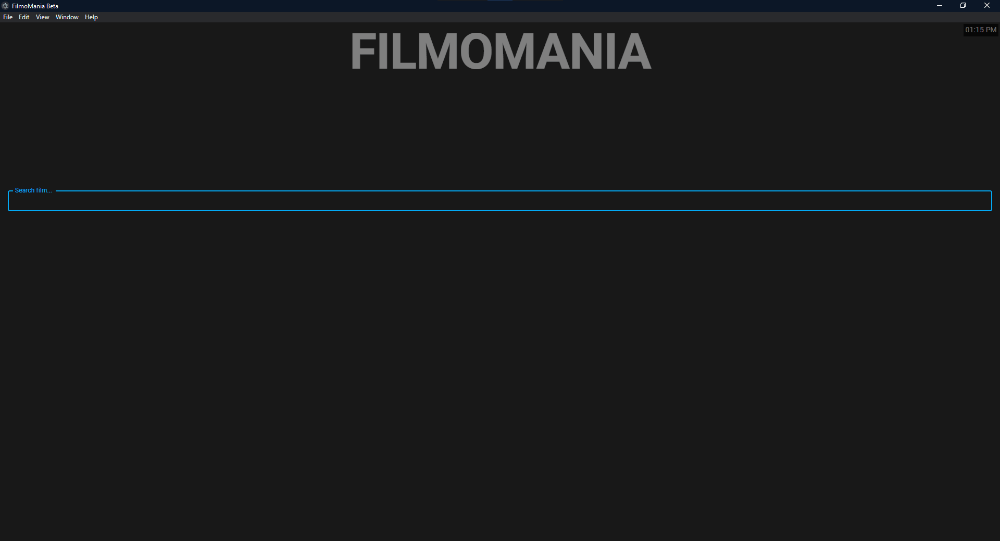
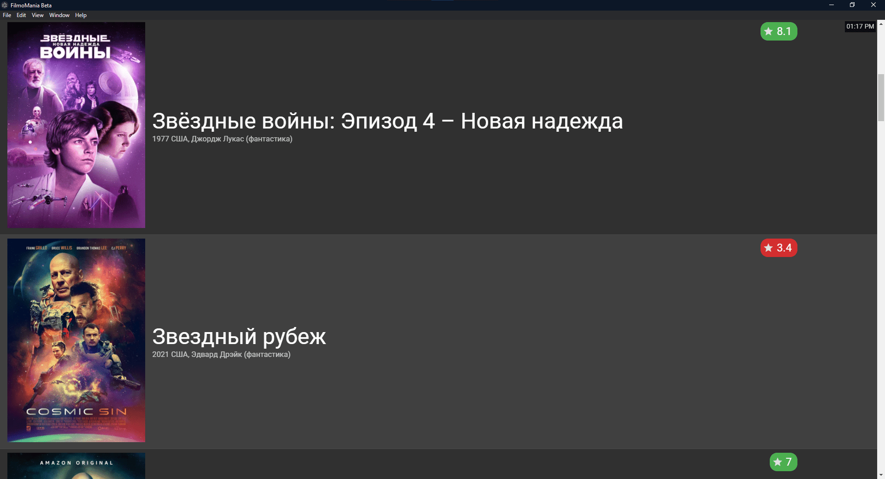
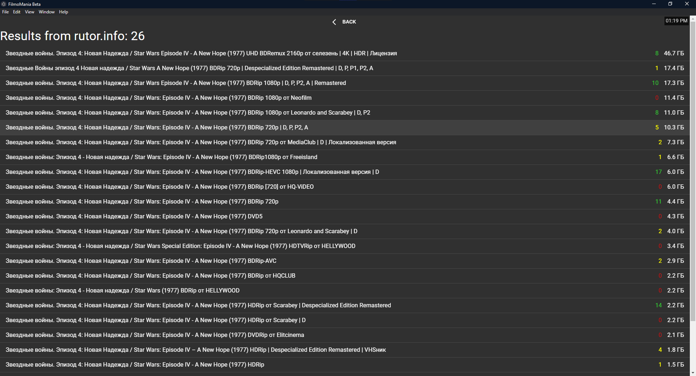

# 🎞️ FILMOMANIA

Project development freezed :( Going to work on it this summer.

Screenshots

I know, design is bad. I'll use [arwes](https://playground.arwes.dev/core) in future releases.

## Build EXE

- Node.js git and yarn must be installed
- After cloning this repo and installing dependencies (just run `yarn` in terminal) run `yarn build-app`

## Features

- Fast proxy setup (speed'll be increased in future releases)
- It works (I mean it should work)
- ~~Uses Ace Stream underneath~~ now Soda Player Plus (https://github.com/zardoy/soda-player-plus) (but you don't need to install anything manually) UPDATE: I'll migrate to 
- And the last... I don't know any alternatives to it

## Roadmap

- [ ] Rename project?
- [ ] Client redesign
- [ ] A lot of integrations!
- [ ] Razer and aura sdk integration (light effects) with player integration
- [ ] Movie scenes parser
